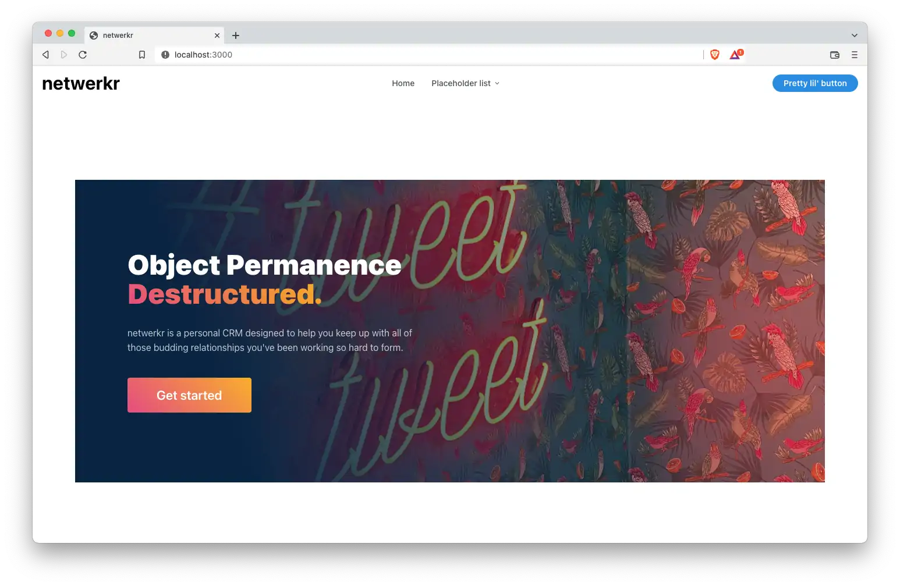

<!-- markdownlint-disable MD033 -->
<h1 align="center">
  <a href="https://github.com/JoeKarow/netwerkr">
    <!-- Please provide path to your logo here -->
    
  </a>
</h1>

<div align="center">
  <h1>netwerkr</h1>
  <br />
  <a href="#about"><strong>Explore the screenshots »</strong></a>
  <br />
  <br />
  <a href="https://github.com/JoeKarow/netwerkr/issues/new?assignees=&labels=bug&template=01_BUG_REPORT.md&title=bug%3A+">Report a Bug</a>
  ·
  <a href="https://github.com/JoeKarow/netwerkr/issues/new?assignees=&labels=enhancement&template=02_FEATURE_REQUEST.md&title=feat%3A+">Request a Feature</a>
  .
  <a href="https://github.com/JoeKarow/netwerkr/issues/new?assignees=&labels=question&template=04_SUPPORT_QUESTION.md&title=support%3A+">Ask a Question</a>
</div>

<div align="center">
<br />

[](LICENSE)

[](https://github.com/JoeKarow/netwerkr/issues?q=is%3Aissue+is%3Aopen+label%3A%22help+wanted%22)
[](https://github.com/JoeKarow)

</div>

<details open="open">
<summary>Table of Contents</summary>

- [About](#about)
  - [Built With](#built-with)
- [Getting Started](#getting-started)
  - [Prerequisites](#prerequisites)
  - [Installation](#installation)
- [Usage](#usage)
- [Roadmap](#roadmap)
- [Support](#support)
- [Project assistance](#project-assistance)
- [Contributing](#contributing)
- [Authors & contributors](#authors--contributors)
- [Security](#security)
- [License](#license)
- [Acknowledgements](#acknowledgements)

</details>

---

## About

> Networking is hard work, especially for those with a poor working memory.
> netwerkr seeks to help keep track of all of those amazing new connections.

<details>
<summary>Screenshots</summary>
<br>

> Screenshots coming soon..

|                               Home Page                               |                               Login Page                               |
| :-------------------------------------------------------------------: | :--------------------------------------------------------------------: |
|  |  |

</details>

### Built With

- [Next.js](https://nextjs.org/)
- [Mantine UI](https://mantine.dev/)
- [Turborepo](https://turborepo.org/)

## Getting Started

### Prerequisites

- [NodeJS >= 16](https://nodejs.dev/)
- [pnpm](https://pnpm.io/)

### Installation

  ```bash
pnpm install
  ```

## Usage

```bash
pnpm dev
```

## Roadmap

See the [open issues](https://github.com/JoeKarow/netwerkr/issues) for a list of proposed features (and known issues).

- [Top Feature Requests](https://github.com/JoeKarow/netwerkr/issues?q=label%3Aenhancement+is%3Aopen+sort%3Areactions-%2B1-desc) (Add your votes using the 👍 reaction)
- [Top Bugs](https://github.com/JoeKarow/netwerkr/issues?q=is%3Aissue+is%3Aopen+label%3Abug+sort%3Areactions-%2B1-desc) (Add your votes using the 👍 reaction)
- [Newest Bugs](https://github.com/JoeKarow/netwerkr/issues?q=is%3Aopen+is%3Aissue+label%3Abug)

## Support

Reach out to the maintainer at one of the following places:

- [GitHub issues](https://github.com/JoeKarow/netwerkr/issues/new?assignees=&labels=question&template=04_SUPPORT_QUESTION.md&title=support%3A+)
- Contact options listed on [this GitHub profile](https://github.com/JoeKarow)

## Project assistance

If you want to say **thank you** or/and support active development of netwerkr:

- Add a [GitHub Star](https://github.com/JoeKarow/netwerkr) to the project.
- Tweet about the netwerkr.
- Write interesting articles about the project on [Dev.to](https://dev.to/), [Medium](https://medium.com/) or your personal blog.

Together, we can make netwerkr **better**!

## Contributing

First off, thanks for taking the time to contribute! Contributions are what make the open-source community such an amazing place to learn, inspire, and create. Any contributions you make will benefit everybody else and are **greatly appreciated**.

Please read [our contribution guidelines](docs/CONTRIBUTING.md), and thank you for being involved!

## Authors & contributors

The original setup of this repository is by [Joe Karow](https://github.com/JoeKarow).

For a full list of all authors and contributors, see [the contributors page](https://github.com/JoeKarow/netwerkr/contributors).

## Security

netwerkr follows good practices of security, but 100% security cannot be assured.
netwerkr is provided **"as is"** without any **warranty**. Use at your own risk.

_For more information and to report security issues, please refer to our [security documentation](docs/SECURITY.md)._

## License

This project is licensed under the **GNU General Public License v3**.

See [LICENSE](LICENSE) for more information.

## Acknowledgements

<!-- > **[?]**
> If your work was funded by any organization or institution, acknowledge their support here.
> In addition, if your work relies on other software libraries, or was inspired by looking at other work, it is appropriate to acknowledge this intellectual debt too. -->
